## Operator Precedence and Associativity

Parsed using Pratt parsing with the following binding powers:

| BP | Operators | Location | Associativity |
|----|-----------|--------|---------------|
| 90 | `++` `--` | Postfix | — |
| 80 | `!` `~` `-` `+` `*` `&` `++` `--` | Prefix | — |
| 70 | `*` `/` `%` | Infix | Left |
| 60 | `+` `-` | Infix | Left |
| 55 | `<<` `>>` | Infix | Left |
| 50 | `<` `>` `<=` `>=` | Infix | Left |
| 45 | `==` `!=` | Infix | Left |
| 40 | `&` | Infix | Left |
| 35 | `^` | Infix | Left |
| 30 | `|` | Infix | Left |
| 25 | `&&` | Infix | Left |
| 20 | `||` | Infix | Left |
| 10 | `=` `+=` `-=` `*=` `/=` `%=` | Infix | Right |


## Grammar Specification
**program:**

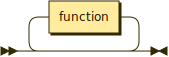

```
program  ::= function*
```

**function:**

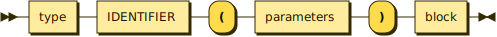

```
function ::= type IDENTIFIER '(' parameters ')' block
```

referenced by:

* program

**parameters:**

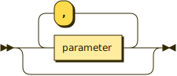

```
parameters
         ::= ( parameter ( ',' parameter )* )?
```

referenced by:

* function

**parameter:**

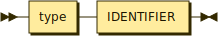

```
parameter
         ::= type IDENTIFIER
```

referenced by:

* parameters

**type:**

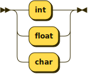

```
type     ::= 'int'
           | 'float'
           | 'char'
```

referenced by:

* function
* parameter
* var_decl

**statement:**

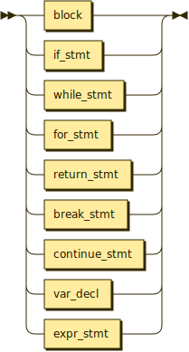

```
statement
         ::= block
           | if_stmt
           | while_stmt
           | for_stmt
           | return_stmt
           | break_stmt
           | continue_stmt
           | var_decl
           | expr_stmt
```

referenced by:

* block
* for_stmt
* if_stmt
* while_stmt

**block:**

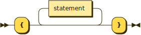

```
block    ::= '{' statement* '}'
```

referenced by:

* function
* statement

**if_stmt:**

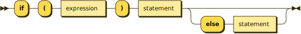

```
if_stmt  ::= 'if' '(' expression ')' statement ( 'else' statement )?
```

referenced by:

* statement

**while_stmt:**

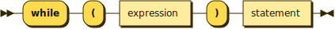

```
while_stmt
         ::= 'while' '(' expression ')' statement
```

referenced by:

* statement

**for_stmt:**

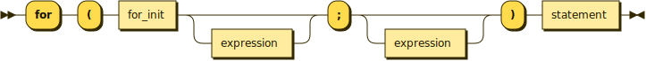

```
for_stmt ::= 'for' '(' for_init expression? ';' expression? ')' statement
```

referenced by:

* statement

**for_init:**

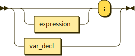

```
for_init ::= expression? ';'
           | var_decl
```

referenced by:

* for_stmt

**return_stmt:**


```
return_stmt
         ::= 'return' expression? ';'
```

referenced by:

* statement

**break_stmt:**


```
break_stmt
         ::= 'break' ';'
```

referenced by:

* statement

**continue_stmt:**


```
continue_stmt
         ::= 'continue' ';'
```

referenced by:

* statement

**var_decl:**

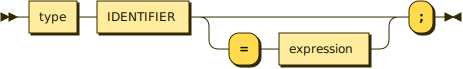

```
var_decl ::= type IDENTIFIER ( '=' expression )? ';'
```

referenced by:

* for_init
* statement

**expr_stmt:**

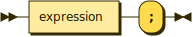

```
expr_stmt
         ::= expression ';'
```

referenced by:

* statement

**expression:**

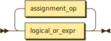

```
expression
         ::= logical_or_expr ( assignment_op logical_or_expr )*
```

referenced by:

* arguments
* expr_stmt
* for_init
* for_stmt
* if_stmt
* primary
* return_stmt
* var_decl
* while_stmt

**assignment_op:**

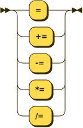

```
assignment_op
         ::= '='
           | '+='
           | '-='
           | '*='
           | '/='
           | '%='
```

referenced by:

* expression

**logical_or_expr:**

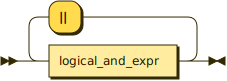

```
logical_or_expr
         ::= logical_and_expr ( '||' logical_and_expr )*
```

referenced by:

* expression

**logical_and_expr:**

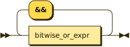

```
logical_and_expr
         ::= bitwise_or_expr ( '&&' bitwise_or_expr )*
```

referenced by:

* logical_or_expr

**bitwise_or_expr:**

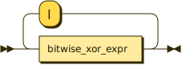

```
bitwise_or_expr
         ::= bitwise_xor_expr ( '|' bitwise_xor_expr )*
```

referenced by:

* logical_and_expr

**bitwise_xor_expr:**

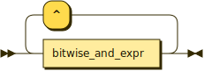

```
bitwise_xor_expr
         ::= bitwise_and_expr ( '^' bitwise_and_expr )*
```

referenced by:

* bitwise_or_expr

**bitwise_and_expr:**

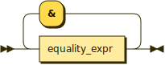

```
bitwise_and_expr
         ::= equality_expr ( '&' equality_expr )*
```

referenced by:

* bitwise_xor_expr

**equality_expr:**

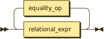

```
equality_expr
         ::= relational_expr ( equality_op relational_expr )*
```

referenced by:

* bitwise_and_expr

**equality_op:**


```
equality_op
         ::= '=='
           | '!='
```

referenced by:

* equality_expr

**relational_expr:**

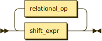

```
relational_expr
         ::= shift_expr ( relational_op shift_expr )*
```

referenced by:

* equality_expr

**relational_op:**


```
relational_op
         ::= '<'
           | '<='
           | '>'
           | '>='
```

referenced by:

* relational_expr

**shift_expr:**

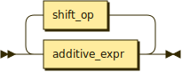

```
shift_expr
         ::= additive_expr ( shift_op additive_expr )*
```

referenced by:

* relational_expr

**shift_op:**


```
shift_op ::= '<<'
           | '>>'
```

referenced by:

* shift_expr

**additive_expr:**

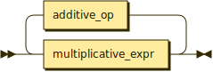

```
additive_expr
         ::= multiplicative_expr ( additive_op multiplicative_expr )*
```

referenced by:

* shift_expr

**additive_op:**


```
additive_op
         ::= '+'
           | '-'
```

referenced by:

* additive_expr

**multiplicative_expr:**

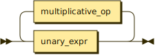

```
multiplicative_expr
         ::= unary_expr ( multiplicative_op unary_expr )*
```

referenced by:

* additive_expr

**multiplicative_op:**


```
multiplicative_op
         ::= '*'
           | '/'
           | '%'
```

referenced by:

* multiplicative_expr

**unary_expr:**

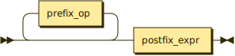

```
unary_expr
         ::= prefix_op* postfix_expr
```

referenced by:

* multiplicative_expr

**prefix_op:**

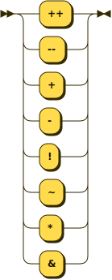

```
prefix_op
         ::= '++'
           | '--'
           | '+'
           | '-'
           | '!'
           | '~'
           | '*'
           | '&'
```

referenced by:

* unary_expr

**postfix_expr:**

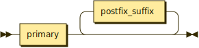

```
postfix_expr
         ::= primary postfix_suffix*
```

referenced by:

* unary_expr

**postfix_suffix:**

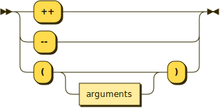

```
postfix_suffix
         ::= '++'
           | '--'
           | '(' arguments? ')'
```

referenced by:

* postfix_expr

**arguments:**


```
arguments
         ::= expression ( ',' expression )*
```

referenced by:

* postfix_suffix

**primary:**

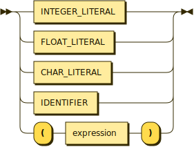

```
primary  ::= INTEGER_LITERAL
           | FLOAT_LITERAL
           | CHAR_LITERAL
           | IDENTIFIER
           | '(' expression ')'
```

referenced by:

* postfix_expr

**INTEGER_LITERAL:**

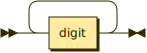

```
INTEGER_LITERAL
         ::= digit+
```

referenced by:

* primary

**FLOAT_LITERAL:**

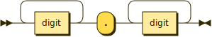

```
FLOAT_LITERAL
         ::= digit+ '.' digit+
```

referenced by:

* primary

**CHAR_LITERAL:**


```
CHAR_LITERAL
         ::= "'" ( character | escape_sequence ) "'"
```

referenced by:

* primary

**IDENTIFIER:**

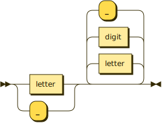

```
IDENTIFIER
         ::= ( letter | '_' ) ( letter | digit | '_' )*
```

referenced by:

* function
* parameter
* primary
* var_decl

**digit:**


```
digit    ::= [0-9]
```

referenced by:

* FLOAT_LITERAL
* IDENTIFIER
* INTEGER_LITERAL

**letter:**


```
letter   ::= [a-zA-Z]
```

referenced by:

* IDENTIFIER

**character:**

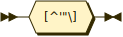

```
character
         ::= [^'"\]
```

referenced by:

* CHAR_LITERAL

**escape_sequence:**

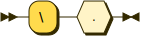

```
escape_sequence
         ::= '\' .
```

referenced by:

* CHAR_LITERAL

##
 <sup>generated by [RR - Railroad Diagram Generator][RR]</sup>

[RR]: https://www.bottlecaps.de/rr/ui
